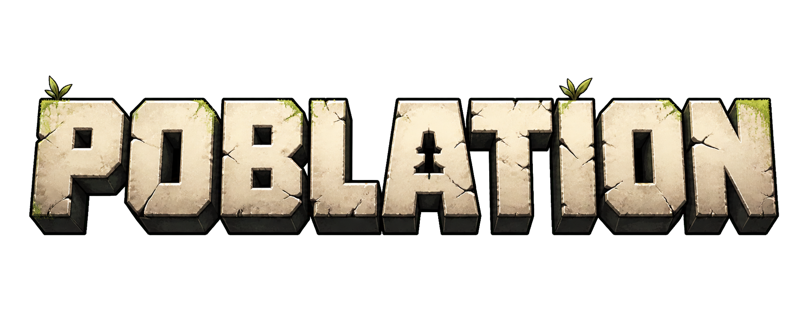

# POBLATION



**A terminal life sim about memory, secrets, desire, family, power, and the terrible little societies people build when they think nobody is watching.**

[](https://github.com/Jaziel8910/poblation/releases/tag/v1.0.0.2)


> The humans are gone. The Pobles remain. Good luck watching them remember everything.

## Play The Beta

**Recommended on Windows:** download the single ready-to-play zip from the latest release.

1. Go to [POBLATION v1.0.0.2](https://github.com/Jaziel8910/poblation/releases/tag/v1.0.0.2).
2. Download `POBLATION_v1.0.0.2_WINDOWS_READY.zip`.
3. Unzip it.
4. Double-click `OPEN POBLATION.bat`.
5. Read `TUTORIAL.txt` if Windows asks anything confusing.

Manual option:

- Download `poblation_windows_amd64.exe` only if you already know how to run terminal apps.
- Run it from a terminal.
- The executable is portable and prepares its runtime under `~/.poblation`.

## What Makes It Different

POBLATION does not use runtime LLM calls. Its drama comes from code: memory, needs, relationships, decision trees, events, saves, and curated templates.

Pobles can:

- remember old harm, favors, intimacy, fear, and public shame;
- make decisions based on needs, mood, archetype, relationships, and memory;
- argue, reconcile badly, become jealous, distance themselves, confess, grieve, obsess, and forgive with limits;
- leave traces in diaries, letters, dreams, rumours, news, feed events, and endings;
- build a messy civilization with family pressure, economy, institutions, technology, laws, scarcity, and consequences.

## Beta Contents

| System | Beta Status |
| --- | --- |
| Memory and decisions | Implemented and visible in intent/reason surfaces |
| Pobles and relationships | Playable, with family and social consequence hooks |
| Civilization | Government, economy, institutions, crisis pressure, settlement view |
| Narrative templates | `1,814` curated templates after removing generated filler |
| Endings | Multiple heavier routes with narrative chapters |
| Saves | JSON + gzip under `~/.poblation` |
| Launcher | Lightweight terminal launcher with install/play/list/saves/news/doctor |

## Launcher Commands

```bash
poblation-launcher install v1.0.0.2
poblation-launcher play
poblation-launcher list
poblation-launcher saves
poblation-launcher news
poblation-launcher doctor
```

## Controls

| Key | Action |
| --- | --- |
| `M` | Mind view |
| `S` | Settlement |
| `P` | Pobles list |
| `E` | Event feed |
| `SPACE` | Pause/resume |
| `ENTER` | Select |
| `ESC` | Back |
| `` ` `` | Debug console |
| `Q` | Quit |

## Content Warning

POBLATION is for adults. It includes explicit sexual systems, violence, death, grief, obsession, betrayal, power abuse, illness, family collapse, and dark comedy.

## Repo Layout

```text
poblation/           main game
poblation-launcher/  lightweight installer/launcher
RELEASE_NOTES_*.md   release notes
```

## License

Source-available under the POBLATION Game-Source License.
